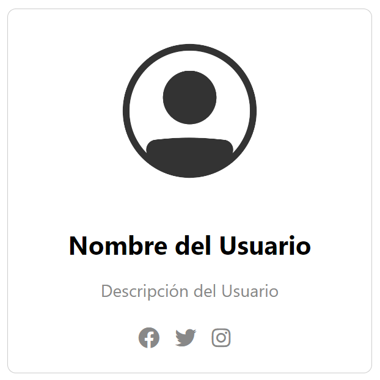
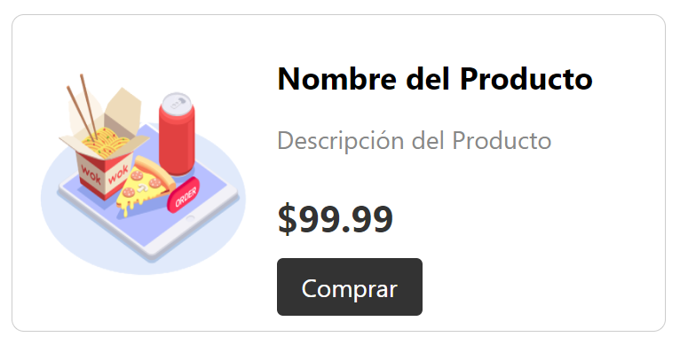
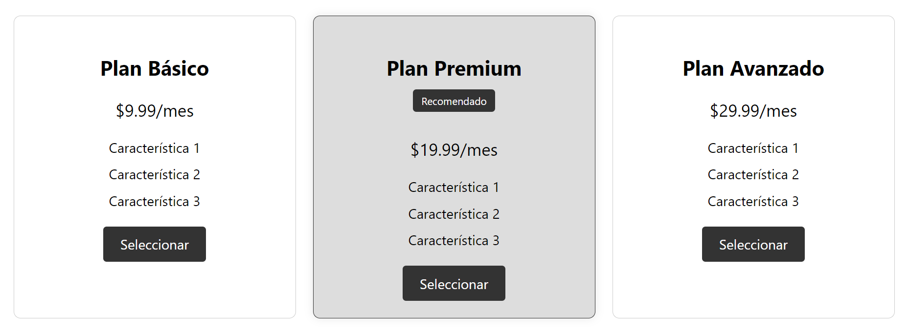
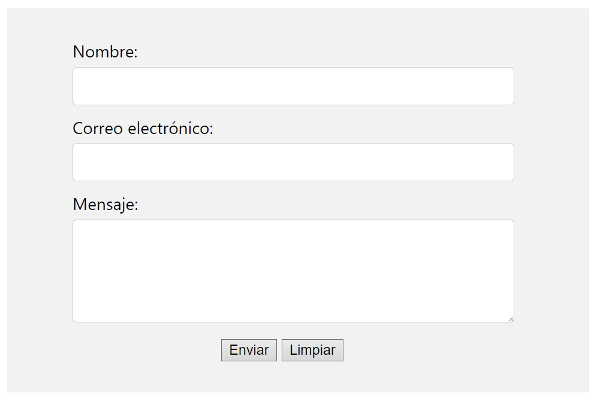
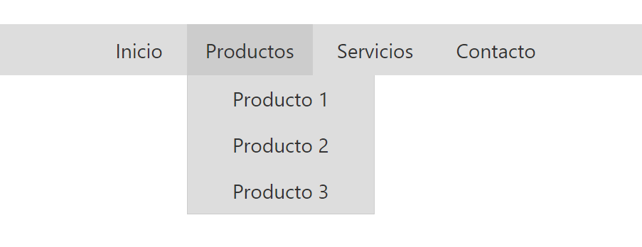
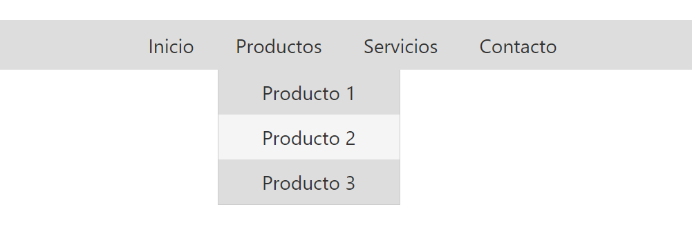

    

 

# Fullstack Java Agosto 2025 - Ford Enter

 

## Fundamentos de la Web: Ejercicios EXTRA de HTML/CSS

1. Crea una lista de enlaces que se muestre en forma de menú horizontal en lugar de vertical. Podrás aplicar cuantos estilos y espaciados creas necesarios para mejorar su apariencia. Mínimamente debería verse como una barra de navegación similar a esta:
 
 

    

 
2. Diseña una tarjeta de perfil que muestre información personal, como una imagen de perfil, nombre, descripción y enlaces a redes sociales. Podrás aplicar cuantos estilos creas necesarios para lograr un diseño atractivo al usuario. Mínimamente, debería verse similar a esta:
 
 

    

 
3. Crea una tarjeta de producto rectangular con orientación horizontal que muestre una imagen, título, descripción y precio. Podrás aplicar cuantos estilos creas necesarios para resaltar los elementos clave y hacer que la tarjeta sea atractiva visualmente, respetando las jerarquías de información. Mínimamente, debería verse similar a esta:
 
 

    

 
4. Diseña una lista de precios con diferentes planes o paquetes de servicios. Podrás aplicar cuantos estilos creas necesarios para resaltar el plan recomendado y mostrar las características de cada uno. Mínimamente, debería verse similar a esto:
 
 

    

 
5. Crea un formulario de contacto con campos para el nombre, correo electrónico y mensaje. Puedes aplicar estilos a los campos de acuerdo a la interacción del usuario y agregar diferentes botones, como por ejemplo: un botón de envío. Mínimamente, debería verse similar a esto:
 
 

    

 
6. Crea un menú de navegación con elementos desplegables. Puedes agregar submenús que se muestren al pasar el cursor sobre los elementos principales del menú, mejorando así la experiencia de navegación. Incluso puedes reutilizar el código del primer ejercicio. Mínimamente, debería verse similar a esto:
 
 

    

 

    

 